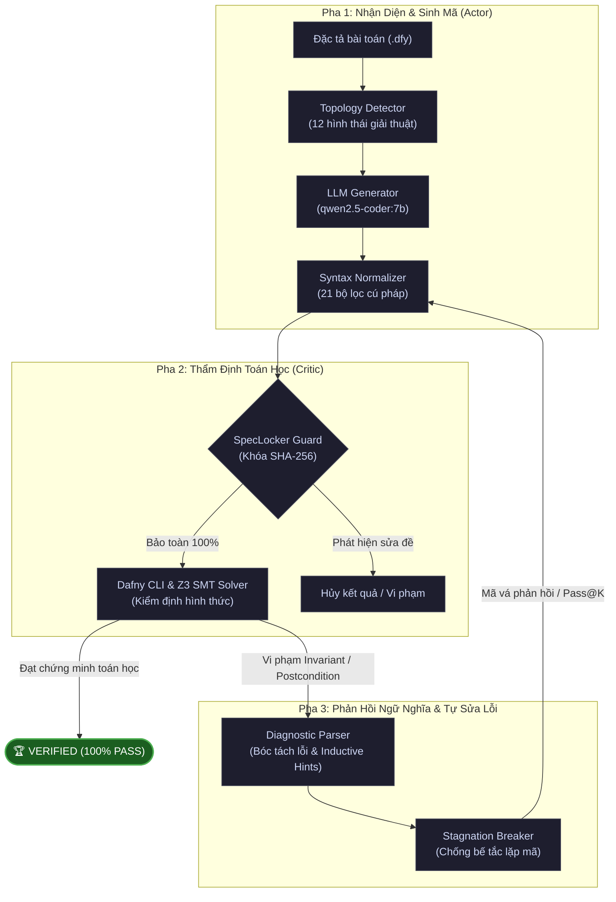

# TỔNG QUAN HỆ THỐNG FORMAL VERIFICATION-IN-THE-LOOP
**Dự án**: Nghiên cứu khung sinh mã nguồn và tự sửa lỗi tự động loại bỏ ảo giác dựa trên kiểm định logic hình thức (Formal Verification-in-the-Loop)

---

## 1. Mục Tiêu & Vấn Đề Khoa Học (Problem Statement)

### Vấn Đề Cốt Lõi:
- Các mô hình ngôn ngữ lớn (LLM như GPT, DeepSeek, Qwen) khi sinh mã thường gặp phải hiện tượng **ảo giác (hallucination)**: code nhìn có vẻ đúng về cú pháp nhưng vi phạm logic toán học, tràn số, sai sót ở các trường hợp biên (edge cases) hoặc lặp vô tận.
- Kiểm thử truyền thống (Unit Tests) chỉ kiểm tra được một số hữu hạn ca kiểm thử cụ thể ($O(1)$), không thể đảm bảo phần mềm không có lỗi trên toàn bộ không gian dữ liệu vô hạn.

### Giải Pháp Của Hệ Thống:
- Tích hợp **Kiểm định logic hình thức (Formal Verification)** với ngôn ngữ **Dafny 4.x** và bộ giải **Z3 SMT Solver** vào vòng lặp sinh mã.
- Z3 thẩm định toán học mọi nhánh thực thi dựa trên tiền điều kiện (`requires`) và hậu điều kiện (`ensures`). Mã nguồn chỉ được công nhận là **PASS** khi bộ giải toán học chứng minh được tính đúng đắn tuyệt đối $100\%$ (**Zero-Hallucination**).

---

## 2. Kiến Trúc Vòng Lặp Khép Kín (Closed-Loop Actor-Critic Architecture)

Hệ thống hoạt động theo quy trình 3 pha tự động hoàn toàn:



---

## 3. Bốn Trụ Cột Kỹ Thuật Cốt Lõi

### Trụ Cột 1: Bộ Nhận Diện Hình Thái Giải Thuật ([core/topology_detector.py](file:///c:/Users/aaa/Pictures/SaveCode/Formal_Verification-in-the-Loop/core/topology_detector.py))
Phân loại bài toán thành **12 hình thái giải thuật** để cung cấp khung gợi ý cấu trúc (Inductive Skeleton), chặn đứng việc LLM sinh vòng lặp rác:
1. `DIRECT`: Tính toán giải tích trực tiếp, cấm dùng vòng lặp (`abs_val`, `sign_function`, `truncate`).
2. `LINEAR_LOOP`: Duyệt mảng tuần tự với bất biến biên và tiền tố (`linear_search`, `max-element`, `below-threshold`).
3. `PURE_FUNC_EQUIV`: Tính tương đương hàm thuần túy/đệ quy hoặc quy nạp chuỗi (`count_elements`, `fib`, `sum_positive`).
4. `NESTED_LOOP`: Kiểm định cặp chỉ số tồn tại (`has_close_elements`) hoặc toàn thể (`is_array_sorted`, `all_unique`).
5. `NUMBER_THEORY`: Số học, Euclid GCD, số nguyên tố (`gcd`, `is_prime`).
6. `NON_LINEAR`: Số học phi tuyến tính bậc cao, căn bậc 3 (`iscube`).
7. `STRING_SEQUENCE`: Đảo chuỗi và đối xứng chuỗi inline (`is_palindrome`).
8. `PERMUTATION_SORT`: Sắp xếp mảng và bảo toàn đa tập hợp multiset (`sort_array`).
9. `BINARY_SEARCH`: Tìm kiếm nhị phân chia đôi chặn biên (`binary_search`).
10. `ORDERED_INSERT`: Chèn có thứ tự bảo toàn tính sắp xếp (`sorted_insert`).
11. `SEQ_CONSTRUCTION`: Xây dựng mảng mới, lọc phần tử (`copy_array`, `remove_element`, `array_reverse`).
12. `SEARCH_CONDITION`: Tìm kiếm có điều kiện phủ định biên (`linear_search_last`, `find_first_negative`).

### Trụ Cột 2: Chuẩn Hóa Cú Pháp Tự Động ([core/syntax_normalizer.py](file:///c:/Users/aaa/Pictures/SaveCode/Formal_Verification-in-the-Loop/core/syntax_normalizer.py))
Gồm **21 phép biến đổi Source-to-Source** sửa lỗi cú pháp mà mô hình 7B hay mắc phải:
- Khắc phục lỗi phủ định toán tử so sánh: `!s[i] <= s[j]` $\to$ `s[i] > s[j]`.
- Tự động bổ sung `var` khi gán biến mới.
- Ép kiểu số thực an toàn `floor as real`, khởi tạo biến boolean definite assignment.
- Tự chèn các bổ đề sắp xếp (`insert_multiset`, `insert_sorted`, `insert_len`) khi thiếu.

### Trụ Cột 3: Khóa Đặc Tả Chống Gian Lận ([core/spec_locker.py](file:///c:/Users/aaa/Pictures/SaveCode/Formal_Verification-in-the-Loop/core/spec_locker.py))
- Toàn bộ tiền điều kiện (`requires`) và hậu điều kiện (`ensures`) được băm bằng mã **SHA-256**.
- Ngăn chặn triệt để hiện tượng mô hình tự ý xóa bỏ hoặc làm lỏng điều kiện kiểm định để "ăn gian" bộ giải Z3. Đảm bảo $100\%$ liêm chính khoa học.

### Trụ Cột 4: Chẩn Đoán Ngữ Nghĩa & Phá Vỡ Bế Tắc ([core/diagnostic_parser.py](file:///c:/Users/aaa/Pictures/SaveCode/Formal_Verification-in-the-Loop/core/diagnostic_parser.py))
- Bóc tách vết lỗi từ Z3: vi phạm bất biến vòng lặp (`LoopInvariantViolation`), vi phạm hậu điều kiện (`PostconditionViolation`), vượt biên mảng (`OutOfBounds`).
- Khi phát hiện mã sửa đổi bị trùng lặp $\ge 90\%$ giữa các vòng lặp (Stagnation), bộ điều khiển sẽ kích hoạt chiến thuật phá bế tắc, tăng nhiệt độ suy diễn để khám phá không gian giải pháp mới.

---

## 4. Danh Mục Benchmark & Kết Quả Thực Nghiệm

Quy mô khảo sát gồm **30 bài toán thuật toán** chia làm 3 nhóm chuẩn mực:

| Nhóm Benchmark | Quy mô | Các bài toán tiêu biểu | Tỷ lệ PASS |
| :--- | :---: | :--- | :---: |
| **Clover Benchmark (Stanford)** | 6 bài | `abs_val`, `find_min`, `linear_search`, `sample_max`, `sign_function`, `sum_to_n` | **100% (6/6)** |
| **HumanEval-Dafny (JetBrains)** | 10 bài | `000-has_close_elements`, `002-truncate`, `010-is_palindrome`, `013-gcd`, `031-is_prime`, `035-max_element`, `052-below_threshold`, `055-fib`, `077-iscube`, `088-sort_array` | **100% (10/10)** |
| **Advanced / Extended Benchmark** | 14 bài | `binary_search`, `linear_search_last`, `find_first_negative`, `array_reverse`, `is_array_sorted`, `remove_element`, `copy_array`, `count_elements`, `sum_positive`, `product_of_array`, `all_unique`, `matrix_row_sum`, `matrix_diagonal_sum`, `sorted_insert` | **100% (14/14)** |
| **TỔNG CỘNG TOÀN HỆ THỐNG** | **30 bài** | **Đa dạng từ mảng, chuỗi, ma trận, số học, đến sắp xếp đa tập hợp** | **🏆 100.0% (30/30)** |

---

## 5. Giao Diện Người Dùng & Các Chế Độ Hoạt Động ([app.py](file:///c:/Users/aaa/Pictures/SaveCode/Formal_Verification-in-the-Loop/app.py))

Giao diện Web Streamlit hiện đại với 3 chế độ linh hoạt:
1. **Chế độ Đơn (`Single`)**: Chọn từng bài toán, tùy biến tham số `Pass@K`, `Timeout`, theo dõi tiến trình kiểm định từng lượt qua đồng hồ thời gian thực và xem mã verified tô màu cú pháp.
2. **Chế độ Hàng loạt (`Batch`)**: Chạy đánh giá tự động trên toàn bộ 30 bài toán (hoặc nhóm bài tự chọn), hiển thị bảng kết quả tổng hợp với trạng thái Z3, số lượt hội tụ, thời gian và hình thái giải thuật. Tự động lưu trữ kiên cố vào [artifacts/results/last_batch_run.json](file:///c:/Users/aaa/Pictures/SaveCode/Formal_Verification-in-the-Loop/artifacts/results/last_batch_run.json).
3. **Chế độ Tự do (`Playground`)**: Cho phép người dùng tự viết đặc tả bài toán mới, nạp nhanh 3 mẫu chuẩn mực (Fibonacci, Kiểm tra mảng tăng dần, Đếm số chẵn), sau đó bấm nút để LLM tự sinh mã và Z3 kiểm định khép kín.

---

## 6. Sơ Đồ Cấu Trúc Mã Nguồn

```text
Formal_Verification-in-the-Loop/
├── app.py                         # Giao diện Web tương tác Streamlit (3 chế độ)
├── core/
│   ├── dafny_engine.py            # Giao tiếp với Dafny CLI và Z3 SMT Solver
│   ├── topology_detector.py       # Bộ nhận diện 12 hình thái giải thuật & Inductive Skeletons
│   ├── syntax_normalizer.py       # Bộ 21 phép chuẩn hóa cú pháp tự động
│   ├── spec_locker.py             # Bộ khóa đặc tả SHA-256 bảo vệ tính toàn vẹn
│   ├── diagnostic_parser.py       # Phân tích vết lỗi Z3 và sinh chỉ dẫn sửa lỗi
│   ├── pipeline_controller.py     # Bộ điều phối vòng lặp khép kín Pass@K
│   ├── template_preserver.py      # Bảo toàn nguyên vẹn hàm pure và chữ ký
│   └── ast_localizer.py           # Định vị khối bất biến cấp AST
├── agents/
│   ├── base_agent.py              # Interface trừu tượng cho Agent
│   └── llm_agent.py               # Kết nối LiteLLM / Ollama (qwen2.5-coder:7b)
├── data/benchmarks/
│   ├── clover/                    # 6 bài toán CloverBench
│   ├── humaneval_dafny/           # 10 bài toán HumanEval-Dafny
│   └── advanced/                  # 14 bài toán giải thuật mở rộng
├── web_demo/
│   └── helpers.py                 # Quản lý danh mục bài toán và tiện ích UI
├── tests/                         # 42 unit tests tự động (100% green)
├── artifacts/results/             # Kết quả chạy batch và log thực nghiệm
├── CHANGELOG.md                   # Nhật ký phát triển chi tiết theo phiên bản
├── PROJECT_OVERVIEW.md            # Tài liệu tổng quan toàn bộ hệ thống
└── README.md                      # Hướng dẫn cài đặt và khởi chạy dự án
```
