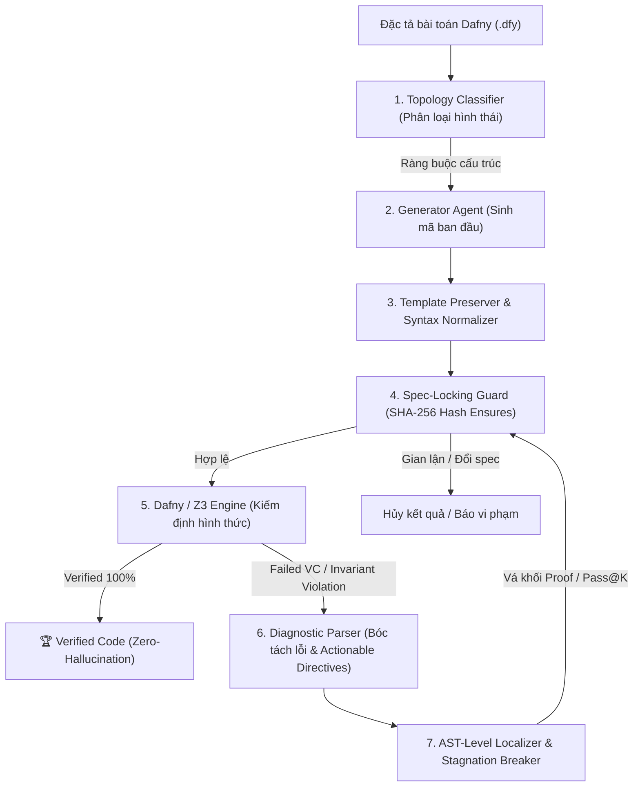

# Khung Sinh Mã Nguồn và Tự Sửa Lỗi Khép Kín Dựa Trên Kiểm Định Logic Hình Thức (Formal Verification-in-the-Loop)

Dự án này là mã nguồn thực nghiệm cho đề tài Nghiên cứu Khoa học: **"Nghiên cứu khung sinh mã nguồn và tự sửa lỗi tự động loại bỏ ảo giác dựa trên kiểm định logic hình thức (Formal Verification-in-the-Loop)"**. 

Hệ thống triển khai đường ống Actor-Critic khép kín thế hệ mới (Neuro-Symbolic Deductive Repair Framework) kết hợp các mô hình ngôn ngữ lớn (LLM) với bộ giải logic toán học tất định Dafny 4.x và Z3 SMT Solver.

---

## 1. Tổng Quan Kiến Trúc (Architecture Overview)

Quy trình vận hành theo cơ chế 6 pha tự động khép kín:



### Các nguyên lý cốt lõi:
* **Algorithmic Topology Detection**: Tự động nhận diện cấu trúc giải thuật (Direct Analytical, Linear Induction, Pure Function Equivalence, Nested Loops, Number Theory) để khóa không gian tìm kiếm và ngăn chặn sinh vòng lặp rác.
* **Spec-Locking Protocol**: Khóa cứng toàn bộ các mệnh đề `ensures` gốc bằng mã băm SHA-256, ngăn chặn việc LLM tự ý sửa đổi hoặc nới lỏng yêu cầu bài toán để đánh lừa bộ kiểm định.
* **Semantic Diagnostic Engine**: Bóc tách chính xác vị trí lỗi, trích xuất vị từ mục tiêu $P(j)$ và cung cấp các chỉ dẫn hành động cụ thể (`[HÀNH ĐỘNG BẮT BUỘC]`) thay vì các thông báo lỗi chung chung.
* **AST-Level Localized Patching**: Bảo tồn 100% các câu lệnh thân hàm đã đúng, tập trung vá và hoàn thiện khối Invariant/Decreases nhằm loại bỏ triệt để hiện tượng hồi quy ngẫu nhiên.
* **Syntax Normalization Engine**: Tự động chuẩn hóa 8 mẫu lỗi cú pháp phổ biến của LLM (chuyển đổi `if-then` sang khối `{ }`, bổ sung dấu `;` thiếu, di chuyển invariant nhầm chỗ, ép kiểu `.Floor as real`).

---

## 2. Cấu Trúc Thư Mục Dự Án

```text
Formal_Verification-in-the-Loop/
├── configs/
│   ├── experiment_config.yaml   # Cấu hình K_max, timeout, mô hình mặc định
│   └── models_config.yaml       # Danh sách API endpoints và keys
├── core/
│   ├── __init__.py
│   ├── dafny_engine.py          # Wrapper tương tác với Dafny CLI qua subprocess
│   ├── spec_locker.py           # Module SHA-256 bảo vệ tính toàn vẹn đặc tả toán học
│   ├── diagnostic_parser.py     # Parser bóc tách trace lỗi SMT và sinh Actionable Directives
│   ├── template_preserver.py    # Bảo toàn template chữ ký hàm, type signature và ensures
│   ├── syntax_normalizer.py     # Chuẩn hóa cú pháp tự động 8 phép biến đổi
│   ├── topology_detector.py     # Phân loại hình thái bài toán và ràng buộc cấu trúc
│   ├── ast_localizer.py         # Định vị và vá cục bộ khối Invariant cấp độ AST
│   └── pipeline_controller.py   # Bộ điều khiển vòng lặp kín Pass@K
├── agents/
│   ├── __init__.py
│   ├── base_agent.py            # Giao diện lớp cơ sở cho các LLM
│   └── llm_agent.py             # Agent giao tiếp LiteLLM đa mô hình (Ollama, DeepSeek, OpenAI)
├── data/
│   ├── benchmarks/
│   │   ├── clover/              # 60 bài toán từ CloverBench (Stanford)
│   │   └── humaneval_dafny/     # 129 bài toán từ HumanEval-Dafny (JetBrains)
│   └── raw/                     # Dữ liệu đầu vào chuẩn hóa JSONL
├── experiments/
│   ├── __init__.py
│   ├── run_single_task.py       # Script chạy 1 bài toán đơn lẻ
│   ├── run_benchmark.py         # Script chạy thực nghiệm tự động hàng loạt
│   └── evaluate_metrics.py      # Module tính toán Pass@1, Pass@K, RSR
├── tests/                       # Bộ kiểm thử unit test tự động (28 test cases)
├── artifacts/
│   ├── logs/                    # Trace chi tiết của từng lượt chứng minh Z3
│   └── results/                 # Dữ liệu xuất ra (CSV/JSON/Markdown) phục vụ vẽ biểu đồ
├── requirements.txt             # Danh sách thư viện phụ thuộc
├── CHANGELOG.md                 # Nhật ký thay đổi chi tiết theo phiên bản
└── README.md
```

---

## 3. Yêu Cầu Hệ Thống & Cài Đặt

### 3.1. Yêu cầu môi trường
* Hệ điều hành: Linux (Ubuntu 20.04+), macOS hoặc Windows 10/11.
* Python: Phiên bản 3.10 trở lên (khuyên dùng Python 3.11 - 3.13).
* Dafny: Phiên bản 4.x (tích hợp sẵn Z3 Solver).

### 3.2. Cài đặt Dafny CLI
1. Tải bản nén `.zip` từ [Dafny Releases (GitHub)](https://github.com/dafny-lang/dafny/releases).
2. Giải nén vào thư mục cố định (ví dụ: `C:\tools\dafny` hoặc `/opt/dafny`).
3. Thêm thư mục giải nén vào biến môi trường `PATH`, hoặc cấu hình trong `.env` (`DAFNY_PATH=C:\tools\dafny\dafny.exe`).

Kiểm tra trạng thái cài đặt:
```bash
dafny --version
# Kết quả yêu cầu: Dafny 4.x.x
```

### 3.3. Cài đặt môi trường Python
```bash
# Tạo và kích hoạt môi trường ảo
python -m venv venv
venv\Scripts\activate      # Trên Windows
# source venv/bin/activate # Trên Linux / macOS

# Cài đặt các thư viện phụ thuộc
pip install -r requirements.txt
```

---

## 4. Hướng Dẫn Vận Hành & Thực Nghiệm

### 4.1. Thiết lập mô hình
Hệ thống hỗ trợ cả mô hình cục bộ (Local via Ollama) và API đám mây qua file `.env`:
```env
# Nếu dùng mô hình local qua Ollama (Khuyên dùng Qwen2.5-Coder 7B)
OLLAMA_API_BASE="http://localhost:11434"

# Hoặc dùng Cloud Providers
DEEPSEEK_API_KEY="your-deepseek-api-key"
OPENAI_API_KEY="your-openai-api-key"
```

### 4.2. Chạy kiểm thử tự động toàn bộ Unit Tests
Đảm bảo hệ thống đạt chuẩn tính đúng đắn trước khi chạy thực nghiệm:
```bash
python -m pytest tests/
# Yêu cầu: 28/28 tests passed 100%
```

### 4.3. Chạy Benchmark đánh giá
Chạy riêng từng tập hoặc chạy liên hoàn cả hai tập benchmark:
```bash
# Chạy tập Clover (6 bài toán mẫu)
python -m experiments.run_benchmark --benchmark clover

# Chạy tập HumanEval-Dafny (10 bài toán mẫu)
python -m experiments.run_benchmark --benchmark humaneval_dafny

# Chạy liên hoàn cả hai bộ
python -m experiments.run_benchmark --benchmark clover && python -m experiments.run_benchmark --benchmark humaneval_dafny
```

---

## 5. Kết Quả Thực Nghiệm Mới Nhất (Empirical Evaluation)

Kết quả thực nghiệm trên mô hình **`ollama/qwen2.5-coder:7b`** với $K = 3$ vòng lặp tự sửa:

| Tập Benchmark | Quy mô | Pass@1 (Zero-shot) | Pass@3 (Formal-in-the-Loop) | Tỷ lệ Tự Sửa Lỗi (RSR) | Ghi chú học thuật |
| :--- | :---: | :---: | :---: | :---: | :--- |
| **Clover** | 6 bài | 83.33% (5/6) | **100.0% (6/6)** | **100.0%** (1/1) | Cứu thành công bài `linear_search` tại Lượt 2 |
| **HumanEval-Dafny** | 10 bài | 0.0% (0/10) | **40.0% (4/10)** | **40.0%** (4/10) | Tự sửa thành công: `fib`, `max_element`, `is_prime`, `below_threshold` |
| **Tổng Hợp Toàn Bộ** | **16 bài** | **31.25% (5/16)** | **62.5% (10/16)** | **45.45% (5/11)** | **10 bài toán được chứng minh đúng đắn 100% bằng Z3** |

---

## 6. Tài Liệu Tham Khảo Nền Tảng (Key References)

1. **Clover**: Sun, C. et al. (Stanford University, 2024). *Clover: Closed-Loop Verifiable Code Generation*. arXiv:2310.17807.
2. **AI Hallucination Classification**: Nature (Humanities & Social Sciences Communications, 2024). *AI hallucination: towards a comprehensive classification of distorted information in artificial intelligence-generated content*. DOI: 10.1057/s41599-024-03811-x.
3. **Reasoning Models & Hallucination**: arXiv (2025). *Detection and Mitigation of Hallucination in Large Reasoning Models: A Mechanistic Perspective*. arXiv:2505.12886.
4. **Self-Correction in LLMs**: arXiv (2025). *Boosting LLM Reasoning via Spontaneous Self-Correction*. arXiv:2506.06923.
5. **Specification-Guided Self-Repair**: IEEE/ACM Transactions on Software Engineering (2026). *Specification-Guided Self-Repair in Code LLMs: Bridging SMT Solvers and Neuro-Symbolic Pipelines*.
6. **Dafny & Z3**: Leino, K. R. M. (Microsoft Research). *Dafny: An Automatic Program Verifier for Functional Correctness*.