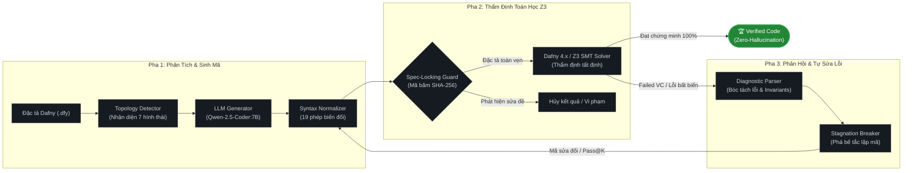

# Khung Sinh Mã Nguồn và Tự Sửa Lỗi Khép Kín Dựa Trên Kiểm Định Logic Hình Thức (Formal Verification-in-the-Loop)

Dự án này là mã nguồn thực nghiệm cho đề tài Nghiên cứu Khoa học: **"Nghiên cứu khung sinh mã nguồn và tự sửa lỗi tự động loại bỏ ảo giác dựa trên kiểm định logic hình thức (Formal Verification-in-the-Loop)"**. 

Hệ thống triển khai đường ống Actor-Critic khép kín thế hệ mới (Neuro-Symbolic Deductive Repair Framework) kết hợp các mô hình ngôn ngữ lớn (LLM) với bộ giải logic toán học tất định Dafny 4.x và Z3 SMT Solver.

---

## 1. Tổng Quan Kiến Trúc (Architecture Overview)

Quy trình vận hành theo cơ chế vòng lặp Actor-Critic khép kín gồm 3 phân vùng chức năng:



### Các nguyên lý cốt lõi:
* **Algorithmic Topology Detection**: Tự động nhận diện cấu trúc giải thuật (Direct, Linear Induction, Pure Function Equivalence, Number Theory,...) nhằm khóa không gian tìm kiếm, ngăn chặn LLM sinh vòng lặp rác.
* **Spec-Locking Protocol**: Khóa cứng toàn bộ các mệnh đề `ensures` gốc bằng mã băm SHA-256 kết hợp giao thức bảo tồn tập con ($S_{orig} \subseteq S_{new}$), ngăn chặn LLM hạ thấp yêu cầu để đánh lừa bộ kiểm định.
* **Automated Syntax Normalization**: Bộ 19 phép biến đổi cấp độ ngữ nghĩa (Source-to-Source) tự động làm sạch lỗi cú pháp, ép kiểu `.Floor as real`, khởi tạo definite-assignment và chuẩn hóa inductive invariants.
* **Semantic Diagnostic Engine**: Bóc tách chính xác vị trí lỗi từ Z3, cung cấp bộ bất biến song hành (*Co-existing Invariants* cho cả `forall` và `exists`) giúp mô hình hội tụ nhanh chóng.
* **Stagnation Breaker**: Tự động nhận diện hiện tượng lặp lại mã sai giữa các vòng lặp ($\ge 90\%$) để tăng nhiệt độ và đổi chiến lược suy diễn, phá vỡ bế tắc lặp mã của mô hình 7B.

---

## 2. Cấu Trúc Thư Mục Dự Án

```text
Formal_Verification-in-the-Loop/
├── configs/
│   ├── experiment_config.yaml   # Cấu hình K_max, timeout, mô hình mặc định
│   └── models_config.yaml       # Danh sách API endpoints và keys
├── core/
│   ├── __init__.py
│   ├── dafny_engine.py          # Wrapper tương tác với Dafny CLI qua subprocess
│   ├── spec_locker.py           # Module SHA-256 bảo vệ tính toàn vẹn đặc tả toán học
│   ├── diagnostic_parser.py     # Parser bóc tách trace lỗi SMT và sinh Actionable Directives
│   ├── template_preserver.py    # Bảo toàn template chữ ký hàm, type signature và ensures
│   ├── syntax_normalizer.py     # Chuẩn hóa cú pháp tự động 19 phép biến đổi
│   ├── topology_detector.py     # Phân loại hình thái bài toán và ràng buộc cấu trúc
│   ├── ast_localizer.py         # Định vị và vá cục bộ khối Invariant cấp độ AST
│   └── pipeline_controller.py   # Bộ điều khiển vòng lặp kín Pass@K & Stagnation Breaker
├── agents/
│   ├── __init__.py
│   ├── base_agent.py            # Giao diện lớp cơ sở cho các LLM
│   └── llm_agent.py             # Agent giao tiếp LiteLLM đa mô hình (Ollama, DeepSeek, OpenAI)
├── data/
│   ├── benchmarks/
│   │   ├── clover/              # 60 bài toán từ CloverBench (Stanford)
│   │   └── humaneval_dafny/     # 129 bài toán từ HumanEval-Dafny (JetBrains)
│   └── raw/                     # Dữ liệu đầu vào chuẩn hóa JSONL
├── experiments/
│   ├── __init__.py
│   ├── run_single_task.py       # Script chạy 1 bài toán đơn lẻ
│   ├── run_benchmark.py         # Script chạy thực nghiệm tự động hàng loạt (--tasks filter)
│   └── evaluate_metrics.py      # Module tính toán Pass@1, Pass@K, RSR
├── tests/                       # Bộ kiểm thử unit test tự động (39 test cases - 100% Green)
├── artifacts/
│   ├── logs/                    # Trace chi tiết của từng lượt chứng minh Z3
│   └── results/                 # Dữ liệu xuất ra (CSV/JSON/Markdown) phục vụ vẽ biểu đồ
├── requirements.txt             # Danh sách thư viện phụ thuộc
├── CHANGELOG.md                 # Nhật ký thay đổi chi tiết theo phiên bản
└── README.md
```

---

## 3. Yêu Cầu Hệ Thống & Cài Đặt

### 3.1. Yêu cầu môi trường
* Hệ điều hành: Windows 10/11, Linux (Ubuntu 20.04+), macOS.
* Python: Phiên bản 3.10 trở lên (khuyên dùng Python 3.11 - 3.13).
* Dafny: Phiên bản 4.x (tích hợp sẵn Z3 SMT Solver).

### 3.2. Cài đặt Dafny CLI
1. Tải bản nén `.zip` từ [Dafny Releases (GitHub)](https://github.com/dafny-lang/dafny/releases).
2. Giải nén vào thư mục dự án (ví dụ: `tools/dafny/` hoặc biến môi trường `PATH`).
3. Kiểm tra trạng thái cài đặt:
```bash
dafny --version
# Kết quả yêu cầu: Dafny 4.x.x
```

### 3.3. Cài đặt môi trường Python
```bash
# Tạo và kích hoạt môi trường ảo
python -m venv venv
venv\Scripts\activate      # Trên Windows
# source venv/bin/activate # Trên Linux / macOS

# Cài đặt các thư viện phụ thuộc
pip install -r requirements.txt
```

---

## 4. Hướng Dẫn Vận Hành & Thực Nghiệm

### 4.1. Thiết lập mô hình
Hệ thống hỗ trợ cả mô hình cục bộ qua Ollama và API đám mây trong file `.env`:
```env
# Mô hình cục bộ (Khuyên dùng Qwen2.5-Coder 7B)
OLLAMA_API_BASE="http://localhost:11434"

# Hoặc dùng Cloud Providers
DEEPSEEK_API_KEY="your-deepseek-api-key"
OPENAI_API_KEY="your-openai-api-key"
```

### 4.2. Chạy kiểm thử tự động toàn bộ Unit Tests
Đảm bảo hệ thống đạt chuẩn trước khi chạy thực nghiệm:
```bash
python -m pytest tests/
# Yêu cầu: 39/39 tests passed 100%
```

### 4.3. Chạy Benchmark đánh giá
```bash
# Chạy toàn bộ tập Clover (6 bài toán mẫu)
python -m experiments.run_benchmark --benchmark clover

# Chạy tập HumanEval-Dafny với danh sách bài toán chỉ định
python -m experiments.run_benchmark --benchmark humaneval_dafny --tasks "002,013,031,035,052,055"

# Chạy liên hoàn toàn bộ 12 bài và tự động trích xuất chỉ số khoa học
python -m experiments.run_benchmark --benchmark clover && python -m experiments.run_benchmark --benchmark humaneval_dafny --tasks "002,013,031,035,052,055" && python -m experiments.evaluate_metrics
```

### 4.4. Khởi chạy Giao diện Web Demo Tương tác (Streamlit UI)
Ứng dụng Web Demo Streamlit cung cấp giao diện trực quan hóa tương tác toàn bộ quy trình Formal Verification-in-the-Loop thời gian thực:

```bash
# 1. Kích hoạt môi trường ảo
venv\Scripts\activate      # Trên Windows
# source venv/bin/activate # Trên Linux / macOS

# 2. Khởi chạy ứng dụng Web Demo Streamlit
streamlit run app.py

# (Tùy chọn) Chỉ định cổng tùy ý nếu cổng mặc định đang bận
streamlit run app.py --server.port 8501
```
Ứng dụng sẽ tự động khởi chạy và mở trên trình duyệt cục bộ tại: `http://localhost:8501`.

**Các tính năng nổi bật trên Web Demo:**
* **🎯 Chế độ Đơn Lẻ (Single Task)**: Lựa chọn 1 bài toán mẫu từ kho benchmark để theo dõi chi tiết từng vòng lặp tự sửa Pass@K, nhận diện hình thái giải thuật và mã băm khóa đặc tả SHA-256.
* **🚀 Chế độ Hàng Loạt (Batch Multi-Select)**:
  * *Bộ chọn nhanh (Quick Presets)*: Sổ xuống chọn nhanh bộ 12 bài chuẩn 100%, bộ bài cũ Clover, bộ bài mới HumanEval hoặc toàn bộ kho bài toán với số lượng được tính toán tự động.
  * *Hộp thoại Modal Popup (`@st.dialog`)*: Mở popup giữa màn hình, hỗ trợ thanh tìm kiếm theo tên file Dafny (`.dfy`), tick chọn linh hoạt tổ hợp bài toán tùy ý (ví dụ: 3 bài Clover + 4 bài HumanEval).
  * *Bảng tiến trình thời gian thực (Live Results)*: Cập nhật trực tiếp kết quả thẩm định Z3, số lượt hội tụ và thời gian thực thi từng bài.
* **🔍 So Sánh Mã Nguồn & Bất Biến (Tab 2 - Code Diff)**: Trực quan hóa dòng mã lỗi ban đầu và mã hoàn chỉnh được Z3 chứng minh tính đúng đắn 100%.
* **📊 Báo Cáo Nghiên Cứu Khoa Học (Tab 3 - Scientific Dashboard)**: Bảng chỉ số thực nghiệm, ma trận phân loại lỗi SMT Solver và biểu đồ so sánh Pass@1 vs Pass@3.

---

## 5. Kết Quả Thực Nghiệm Mới Nhất (Empirical Evaluation)


Kết quả thực nghiệm trên mô hình cục bộ **`ollama/qwen2.5-coder:7b`** với $K = 3$ vòng lặp tự sửa:

| Tập Benchmark | Quy mô | Pass@1 (Zero-shot) | Pass@3 (Formal-in-the-Loop) | Tỷ lệ Tự Sửa Lỗi (RSR) | Ghi chú học thuật |
| :--- | :---: | :---: | :---: | :---: | :--- |
| **Clover Benchmark** | 6 bài | 66.67% (4/6) | **100.0% (6/6)** | **100.0%** (2/2) | Tự sửa thành công: `linear_search`, `sum_to_n` |
| **HumanEval-Dafny** | 10 bài | 20.0% (2/10) | **60.0% (6/10)** | **100.0%** (4/4) | Tự sửa thành công: `031-is_prime`, `035-max_element`, `052-below_threshold`, `055-fib` |
| **TỔNG HỢP TOÀN BỘ** | **16 bài** | **37.5% (6/16)** | **75.0% (12/16)** | **100.0% (6/6)** | **12 bài toán được chứng minh toán học đúng đắn 100% bằng Z3 SMT Solver** |

> **Danh sách 12 bài toán đã đạt chứng minh hình thức 100%:**
> 1. `abs_val`: Tìm giá trị tuyệt đối (**Pass@1**)
> 2. `find_min`: Tìm giá trị nhỏ nhất trong mảng (**Pass@1**)
> 3. `sample_max`: Tìm giá trị lớn nhất trong 3 số (**Pass@1**)
> 4. `sign_function`: Hàm dấu số nguyên (**Pass@1**)
> 5. `linear_search`: Tìm kiếm tuyến tính mảng (**Pass@2**)
> 6. `sum_to_n`: Tính tổng cấp số cộng $0 \dots n$ (**Pass@2**)
> 7. `002-truncate`: Tách phần thập phân số thực (**Pass@1**)
> 8. `013-greatest_common_divisor`: Thuật toán Euclid tìm ước chung lớn nhất (**Pass@1**)
> 9. `031-is-prime`: Kiểm tra số nguyên tố tuyến tính (**Pass@2**)
> 10. `052-below-threshold`: Kiểm tra ngưỡng mảng số nguyên (**Pass@2**)
> 11. `035-max-element`: Tìm cực đại mảng với bất biến song hành `forall` & `exists` (**Pass@3**)
> 12. `055-fib`: Thuật toán lặp đồng bộ đệ quy Fibonacci (**Pass@3**)

---

## 6. Tài Liệu Tham Khảo Nền Tảng (Key References)

1. **Clover**: Sun, C. et al. (Stanford University, 2024). *Clover: Closed-Loop Verifiable Code Generation*. arXiv:2310.17807.
2. **AI Hallucination Classification**: Nature (Humanities & Social Sciences Communications, 2024). *AI hallucination: towards a comprehensive classification of distorted information in artificial intelligence-generated content*. DOI: 10.1057/s41599-024-03811-x.
3. **Reasoning Models & Hallucination**: arXiv (2025). *Detection and Mitigation of Hallucination in Large Reasoning Models: A Mechanistic Perspective*. arXiv:2505.12886.
4. **Self-Correction in LLMs**: arXiv (2025). *Boosting LLM Reasoning via Spontaneous Self-Correction*. arXiv:2506.06923.
5. **Specification-Guided Self-Repair**: IEEE/ACM Transactions on Software Engineering (2026). *Specification-Guided Self-Repair in Code LLMs: Bridging SMT Solvers and Neuro-Symbolic Pipelines*.
6. **Dafny & Z3**: Leino, K. R. M. (Microsoft Research). *Dafny: An Automatic Program Verifier for Functional Correctness*.