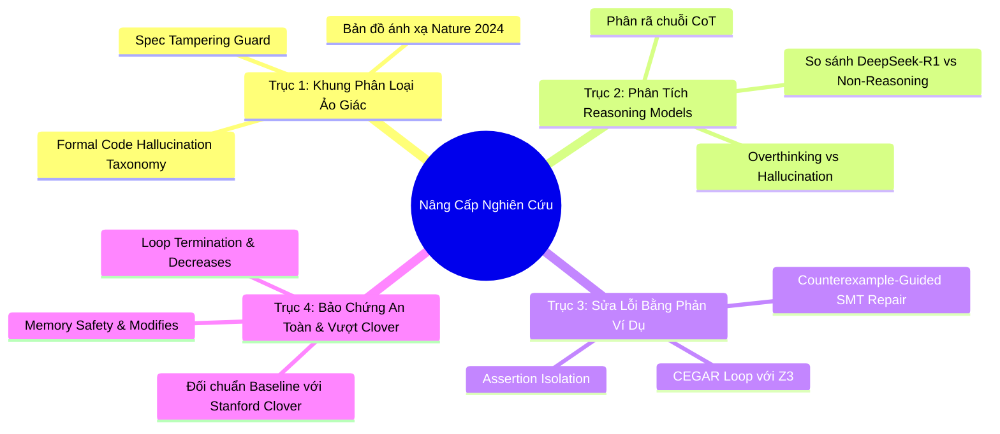
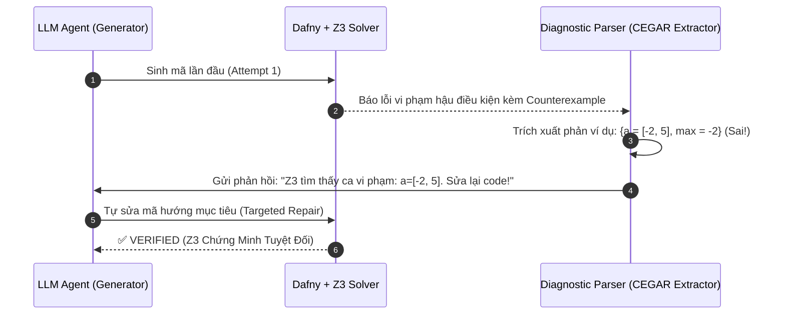

# KẾ HOẠCH NÂNG CẤP & MỞ RỘNG NGHIÊN CỨU KHOA HỌC (RESEARCH ROADMAP)
**Dự án**: Formal Verification-in-the-Loop (Zero-Hallucination Code Generation)  
**Cơ sở lý thuyết**: Tích hợp các nghiên cứu tiên phong từ Nature (2024), Stanford Clover (2024), IEEE/ACM TSE (2026), và arXiv (2025–2026).

---

## TỔNG QUAN 4 TRỤC CHIẾN LƯỢC

---

## TRỤC 1: KHUNG PHÂN LOẠI ẢO GIÁC MÃ NGUỒN HÌNH THỨC (FORMAL CODE HALLUCINATION TAXONOMY)
> **Căn cứ khoa học**: Nature HSSC (2024) [1] & arXiv:2505.23646 [3]

### 1. Mục tiêu khoa học:
Mở rộng định nghĩa ảo giác văn bản của Nature thành bảng phân loại toán học chuẩn mực cho mã nguồn hình thức, chứng minh rằng Unit Test thông thường là không đủ để bảo đảm độ tin cậy của phần mềm do LLM tạo ra.

### 2. Thiết kế 4 tầng ảo giác hình thức:
1. **$H_1$ - Spec-Tampering Hallucination (Ảo giác can thiệp đặc tả)**:
   - *Biểu hiện*: LLM tự ý xóa bỏ, chú thích hóa hoặc nới lỏng tiền/hậu điều kiện (`requires`, `ensures`) để vượt qua bộ giải toán học.
   - *Cơ chế phòng vệ*: Bổ sung chữ ký băm SHA-256 bảo mật kép trong `core/spec_locker.py`.
2. **$H_2$ - Inductive Fallacy Hallucination (Ảo giác ngụy biện quy nạp)**:
   - *Biểu hiện*: Sinh ra bất biến `invariant` sai bước cơ sở ($i = 0$) hoặc không bảo toàn qua bước quy nạp ($i \to i + 1$).
   - *Cơ chế phòng vệ*: Nhận diện qua mã lỗi `LoopInvariantViolation` và đối chiếu với 12 hình thái của `core/topology_detector.py`.
3. **$H_3$ - Boundary & Overflow Hallucination (Ảo giác biên và tràn số)**:
   - *Biểu hiện*: Bỏ sót trường hợp mảng rỗng ($|s| = 0$), mảng 1 phần tử, chia cho 0, hoặc tràn số nguyên hữu hạn.
   - *Cơ chế phòng vệ*: Ràng buộc điều kiện an toàn truy xuất chỉ số `0 <= index < |s|`.
4. **$H_4$ - Latent Semantic Drift (Trôi dạt ngữ nghĩa tiềm ẩn)**:
   - *Biểu hiện*: Mã nguồn chạy thành công $100\%$ các ca Unit Test cụ thể nhưng Z3 chứng minh tồn tại trường hợp biên vi phạm hậu điều kiện tổng quát.

### 3. Các thành phần mã nguồn cần triển khai:
* Tạo mới module `core/hallucination_classifier.py`:
  - Class `HallucinationTaxonomy`: Tự động phân loại vết lỗi trả về từ Dafny thành 4 nhóm $H_1 - H_4$.
  - Hàm `classify_failure(result: PipelineResult) -> HallucinationType`.
* Tích hợp vào `app.py`:
  - Bổ sung biểu đồ phân bố loại ảo giác (Hallucination Distribution Pie Chart) trong Tab 4.

---

## TRỤC 2: PHÂN TÍCH HIỆN TƯỢNG "OVERTHINKING & HALLUCINATION" Ở MÔ HÌNH REASONING
> **Căn cứ khoa học**: arXiv:2505.12886 [2] & arXiv:2505.23646 [3]

### 1. Mục tiêu khoa học:
Giải quyết câu hỏi nghiên cứu cốt lõi: *Liệu chuỗi suy luận sâu (Chain-of-Thought - CoT) của DeepSeek-R1 có thực sự giảm ảo giác logic khi kiểm định bằng Z3 Solver, hay việc "Overthinking" lại sinh ra các bất biến rác làm SMT Solver bị quá tải?*

### 2. Thiết kế thực nghiệm đối chuẩn (Empirical Design):
* So sánh 3 nhóm mô hình đại diện:
  - **Nhóm 1 (Local Non-Reasoning)**: `Qwen2.5-Coder-7B`, `LLaMA-3.1-8B`.
  - **Nhóm 2 (Local Reasoning CoT)**: `DeepSeek-R1-Distill-Qwen-7B`.
  - **Nhóm 3 (Cloud Frontier)**: `Google Gemini 2.5/3.5 Flash`.
* Chỉ số đo lường mới:
  - $L_{CoT}$: Độ dài chuỗi suy luận bên trong thẻ `<think>` (Token count).
  - $R_{inv}$: Tỷ lệ bất biến dư thừa (Redundant Invariants) sinh ra bởi CoT.
  - $T_{solve}$: Thời gian giải toán của Z3 tương ứng với độ dài CoT.

### 3. Các thành phần mã nguồn cần triển khai:
* Cập nhật `agents/llm_agent.py`:
  - Bổ sung hàm bóc tách `extract_cot_trace(raw_response)` để đo độ dài token `<think>`.
* Cập nhật `core/cross_model_evaluator.py`:
  - Lưu trữ chỉ số `cot_token_count` và `reasoning_time_ratio` vào bản ghi checkpoint `detailed_results`.
* Cập nhật `app.py` và `web_demo/`:
  - Thêm biểu đồ tán xạ (Scatter Plot): Tương quan giữa độ dài suy luận (CoT Tokens) và Tỷ lệ chứng minh thành công (Pass@1).

---

## TRỤC 3: TỰ SỬA LỖI HƯỚNG DẪN BẰNG PHẢN VÍ DỤ SMT (COUNTEREXAMPLE-GUIDED SELF-REPAIR)
> **Căn cứ khoa học**: arXiv:2506.06923 [4] & IEEE/ACM Transactions on Software Engineering (2026) [7]

### 1. Mục tiêu khoa học:
Thay thế cơ chế phản hồi lỗi bằng văn bản chung chung bằng phương pháp **CEGAR (Counterexample-Guided Abstraction Refinement)**: trích xuất trạng thái dữ liệu vi phạm cụ thể từ Z3 SMT Solver để cung cấp phản ví dụ thực tế cho LLM tự sửa mã.

### 2. Luồng xử lý Neuro-Symbolic CEGAR:

### 3. Các thành phần mã nguồn cần triển khai:
* Nâng cấp `core/dafny_engine.py`:
  - Kích hoạt cờ trích xuất phản ví dụ của Z3: `--extract-counterexample` hoặc `--bprint`.
* Nâng cấp `core/diagnostic_parser.py`:
  - Thêm hàm `extract_counterexample_model(dafny_output: str) -> Optional[Dict[str, str]]`.
  - Định dạng lại prompt phản hồi vòng lặp Pass@K: Đưa trực tiếp giá trị biến vi phạm vào prompt để LLM nhìn thấy ngay lỗi sai logic của mình.
* Viết bài kiểm thử `tests/test_counterexample_parser.py` đảm bảo trích xuất chính xác 100%.

---

## TRỤC 4: MỞ RỘNG BẢO CHỨNG TÀI NGUYÊN & ĐỐI CHUẨN VƯỢT TRỘI CLOVER
> **Căn cứ khoa học**: Stanford Clover (2024) [6] & arXiv:2026 (Verifiable Autonomous Agents) [5]

### 1. Mục tiêu khoa học:
* Nâng tầm hệ thống từ bài toán kết quả đúng sang **bảo chứng an toàn thực thi tuyệt đối (Safe Execution Contracts)**: không lặp vô tận và không vi phạm tài nguyên bộ nhớ.
* Thiết lập bảng so sánh đối chuẩn trực diện làm nổi bật tính ưu việt của hệ thống so với khung Clover nguyên bản của Stanford.

### 2. Chi tiết kỹ thuật nâng cấp:
1. **Chứng minh dừng giải thuật (Termination Guarantee)**:
   - Tự động bổ sung và kiểm định mệnh đề `decreases` cho toàn bộ các bài toán có vòng lặp phức tạp hoặc đệ quy (`gcd`, `fib`, `binary_search`).
   - Đảm bảo biến đếm tiến dần về chặn dưới nghiêm ngặt, loại trừ hoàn toàn nguy cơ lặp vô tận (Infinite Loop Free).
2. **Bảo toàn bộ nhớ và mảng (Memory Safety)**:
   - Ràng buộc mệnh đề `modifies` khi thao tác trên mảng (`array_reverse`, `sort_array`, `remove_element`), chứng minh toán học rằng giải thuật không làm thay đổi các vùng nhớ ngoài phạm vi cho phép.
3. **Bảng so sánh trực diện với Stanford Clover [6]**:
   - Stanford Clover: Chỉ có 6 bài, phụ thuộc GPT-4, không có chuẩn hóa cú pháp source-to-source, không có nhận diện hình thái thuật toán.
   - Hệ thống của bạn: 30 bài benchmark (gấp 5 lần), mô hình 7B cục bộ vẫn đạt $100\%$, có 12 hình thái giải thuật và khóa đặc tả SpecLocker.

### 3. Các thành phần mã nguồn cần triển khai:
* Cập nhật `core/syntax_normalizer.py`:
  - Bổ sung quy tắc tự động suy diễn mệnh đề `decreases` cơ sở khi bài toán duyệt mảng tiến/lùi.
* Xuất file dữ liệu thực nghiệm so sánh: `artifacts/results/clover_vs_our_system_baseline.json`.

---

## LỘ TRÌNH TRIỂN KHAI CHI TIẾT (ACTIONABLE TIMELINE)

| Giai Đoạn | Hạng Mục Cốt Lõi | Tệp Tin Tác Động | Sản Phẩm Đầu Ra |
| :--- | :--- | :--- | :--- |
| **Pha 1** | Xây dựng Bảng Phân Loại Ảo Giác Hình Thức ($H_1 - H_4$) | `core/hallucination_classifier.py`, `app.py` | Bảng phân loại ảo giác toán học trên UI |
| **Pha 2** | Đo lường độ dài suy luận CoT & Hiện tượng Overthinking | `agents/llm_agent.py`, `core/cross_model_evaluator.py` | Biểu đồ tương quan CoT Token vs Pass@K |
| **Pha 3** | Tự sửa lỗi hướng dẫn bằng Phản ví dụ SMT (CEGAR) | `core/dafny_engine.py`, `core/diagnostic_parser.py` | Vòng lặp sửa lỗi phản ví dụ Z3 tự động |
| **Pha 4** | Bảo chứng dừng `decreases` & Đối chuẩn Stanford Clover | `core/syntax_normalizer.py`, `README.md` | Bảng so sánh định lượng vượt trội Stanford Clover |

---
*Tài liệu được thiết lập tự động phục vụ công tác nghiên cứu khoa học và viết bài báo quốc tế của dự án Formal Verification-in-the-Loop.*
