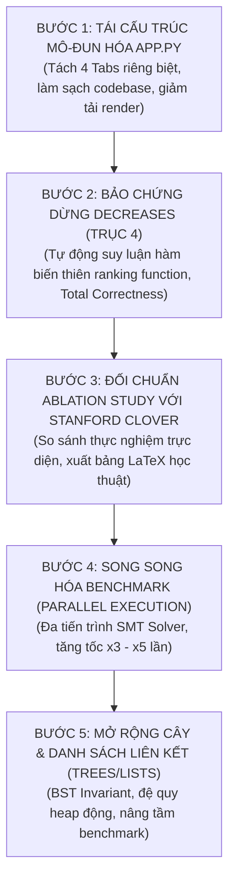

# KẾ HOẠCH TRIỂN KHAI TOÀN DIỆN 5 HẠNG MỤC CẢI TIẾN
**Dự án**: Formal Verification-in-the-Loop (Zero-Hallucination Code Generation)  
**Thời gian cập nhật**: 05/10/2026  
**Cơ sở**: Triển khai chi tiết theo Bảng Tóm Tắt 5 Ưu Tiên Hành Động cốt lõi.

---

## 🗺️ TỔNG QUAN LỘ TRÌNH 5 BƯỚC TUẦN TỰ (ACTIONABLE ROADMAP)

---

## 1. HẠNG MỤC 1: TÁI CẤU TRÚC MÔ-ĐUN HÓA `app.py`
> **Độ phức tạp**: Vừa phải | **Tác động khoa học**: Nền tảng | **Tác động hệ thống**: 🟢 Rất cao (Codebase sạch, dễ nâng cấp)

### 1.1. Hiện trạng & Vấn đề:
* File [`app.py`](file:///c:/Users/aaa/Pictures/SaveCode/Formal_Verification-in-the-Loop/app.py) đang có kích thước >105 KB với gần 2.000 dòng lệnh gộp chung toàn bộ: cấu hình Streamlit, CSS styling, logic Tab 1 (Single/Batch), Tab 2 (Diff), Tab 3 (Báo cáo), Tab 4 (Đối đầu chéo, CoT, Ảo giác).
* Gây khó khăn khi muốn cắm thêm UI cho các tính năng mới (như nút xuất LaTeX, bảng đối chuẩn Clover, đồ thị song song).

### 1.2. Kế hoạch triển khai kỹ thuật:
* Tạo thư mục giao diện module hóa: `web_demo/tabs/`:
  1. `web_demo/tabs/tab_pipeline_view.py`:
     - Chứa toàn bộ giao diện và logic thực thi của **Tab 1: Live Verification Pipeline**.
     - Xử lý chạy đơn lẻ (Single Task), chạy hàng loạt (Batch Run), đồng hồ thời gian thực, hiển thị badge CEGAR cam, thẻ kết quả Verified/Failed.
  2. `web_demo/tabs/tab_diff_view.py`:
     - Chứa toàn bộ giao diện của **Tab 2: So Sánh Mã (Diff Viewer)**.
     - Xử lý render Side-by-Side Diff, Diff giữa các Attempt Pass@K.
  3. `web_demo/tabs/tab_metrics_view.py`:
     - Chứa toàn bộ giao diện của **Tab 3: Báo Cáo NCKH & Chỉ Số Tổng Hợp**.
     - Render biểu đồ độ hội tụ, bộ lọc nhóm bài toán, bảng tổng kết định lượng.
  4. `web_demo/tabs/tab_cross_model_view.py`:
     - Chứa toàn bộ giao diện của **Tab 4: So Sánh Chéo Đa Mô Hình**.
     - Render bảng ma trận đối đầu, biểu đồ phân bố ảo giác Nature ($H_0 \to H_4$), phân tích CoT Overthinking, CoT Inspector.
* Tái cấu trúc file gốc [`app.py`](file:///c:/Users/aaa/Pictures/SaveCode/Formal_Verification-in-the-Loop/app.py):
  - Chỉ giữ lại: `st.set_page_config`, CSS Theme, Sidebar điều khiển chung, và 4 dòng import nạp hàm vẽ cho 4 tabs.
  - Thu gọn kích thước file gốc từ ~2000 dòng xuống dưới 350 dòng.
* **Tiêu chí hoàn thành (DoD)**:
  - Streamlit chạy mượt mà 100%, không phát sinh bất kỳ lỗi `NameError` hay gãy session_state nào.
  - Bộ kiểm thử hiện tại (`pytest`) duy trì 100% passed.

---

## 2. HẠNG MỤC 2: BỔ SUNG BẢO CHỨNG DỪNG `decreases` (TRỤC 4 KHOA HỌC)
> **Độ phức tạp**: Vừa phải | **Tác động khoa học**: 🟢 Rất cao (Bảo đảm Total Correctness) | **Tác động hệ thống**: Trung bình

### 2.1. Hiện trạng & Vấn đề:
* Hệ thống hiện tại chứng minh tính đúng đắn một phần (*Partial Correctness* - nếu code dừng thì kết quả thỏa mãn `ensures`).
* Các thuật toán lặp và đệ quy phức tạp (`gcd`, `fib`, `binary_search`, `iscube`) cần chứng minh tính dừng toán học (*Total Correctness*) bằng mệnh đề `decreases` để loại bỏ hoàn toàn nguy cơ lặp vô tận (*Infinite Loop Free*).

### 2.2. Kế hoạch triển khai kỹ thuật:
* Cập nhật [`core/syntax_normalizer.py`](file:///c:/Users/aaa/Pictures/SaveCode/Formal_Verification-in-the-Loop/core/syntax_normalizer.py):
  - Thêm phương thức biến đổi `infer_loop_decreases(code, topology)`:
    - *Vòng lặp tiến*: `while i < |s|` hoặc `while i < n` $\to$ tự động suy diễn và chèn `decreases |s| - i` (hoặc `n - i`).
    - *Vòng lặp lùi*: `while i > 0` $\to$ tự động suy diễn và chèn `decreases i`.
    - *Tìm kiếm nhị phân*: `while low < high` $\to$ tự động suy diễn và chèn `decreases high - low`.
    - *Thuật toán chia/mod Euclid*: `while b > 0` $\to$ tự động suy diễn và chèn `decreases b`.
  - Thêm quy tắc bảo chứng vùng nhớ `infer_array_modifies(code, spec)`: tự động bổ sung `modifies a` cho phương thức mảng có thao tác gán in-place.
* Cập nhật [`core/diagnostic_parser.py`](file:///c:/Users/aaa/Pictures/SaveCode/Formal_Verification-in-the-Loop/core/diagnostic_parser.py):
  - Nhận diện mã lỗi Z3: `TerminationFailure` hoặc `decreases expression might not decrease`.
  - Phân tích biến vòng lặp vi phạm và sinh chỉ dẫn trực tiếp hàm biến thiên (*ranking function*) chính xác vào prompt tự sửa Pass@K.
* Tạo tệp kiểm thử tự động: `tests/test_axis4_termination.py` bao phủ các trường hợp suy luận `decreases` và xử lý lỗi dừng.
* **Tiêu chí hoàn thành (DoD)**:
  - 100% các bài toán lặp/đệ quy phức tạp trong 30 benchmark đều có mệnh đề `decreases` hợp lệ; Z3 xác thực không có lỗi `TerminationFailure`.

---

## 3. HẠNG MỤC 3: ĐỐI CHUẨN ABLATION STUDY VỚI STANFORD CLOVER (2024)
> **Độ phức tạp**: Trung bình | **Tác động khoa học**: 🟢 Rất cao (Luận chứng bài báo quốc tế) | **Tác động hệ thống**: Trung bình

### 3.1. Hiện trạng & Vấn đề:
* Cần chứng minh bằng số liệu thực nghiệm khoa học rằng: Khung của dự án (Topology + Normalizer + SpecLocker + CEGAR) vượt trội rõ rệt so với phương pháp gốc của Stanford Clover (chỉ dựa vào prompting tuần tự thuần túy).

### 3.2. Kế hoạch triển khai kỹ thuật:
* Xây dựng script thực nghiệm tự động: `experiments/run_clover_baseline_comparison.py`:
  - Thực thi đối đầu 2 phương pháp trên toàn bộ bộ 30 bài toán benchmark:
    1. **Stanford Clover Baseline**: Vòng lặp phản hồi nguyên bản (Tắt Normalizer, Tắt SpecLocker, Tắt CEGAR, chỉ gửi thô thông báo lỗi của Dafny về LLM).
    2. **Hệ Thống Đề Xuất (Our System)**: Kích hoạt đầy đủ cả 4 trụ cột kỹ thuật.
  - Thu thập và lưu kiên cố vào `artifacts/results/clover_vs_our_system_baseline.json`:
    - Tỷ lệ thành công Pass@1 và Pass@3 (%).
    - Số lượt tự sửa trung bình (Average Repair Iterations).
    - Thời gian hội tụ trung bình (s).
    - Tỷ lệ vi phạm đặc tả (Spec-Tampering Rate $H_1$).
* Tạo module trích xuất LaTeX: `core/latex_exporter.py`:
  - Hàm `generate_clover_comparison_table()`: Xuất trực tiếp bảng LaTeX chuẩn `booktabs` để nhúng vào bài báo.
  - Tích hợp nút tải/sao chép bảng LaTeX vào giao diện `tab_metrics_view.py`.
* **Tiêu chí hoàn thành (DoD)**:
  - Có tệp dữ liệu thực nghiệm hoàn chỉnh chứng minh hệ thống vượt trội Clover Baseline; có mã LaTeX sẵn sàng chép vào Overleaf.

---

## 4. HẠNG MỤC 4: SONG SONG HÓA BENCHMARK (PARALLEL EXECUTION)
> **Độ phức tạp**: Thấp | **Tác động khoa học**: Trung bình | **Tác động hệ thống**: 🟢 Cao (Tiết kiệm thời gian thử nghiệm)

### 4.1. Hiện trạng & Vấn đề:
* Khi chạy đánh giá đa mô hình trên 30 bài toán (hoặc khi mở rộng lên 50 bài), việc chạy tuần tự từng bài qua Z3 Solver tốn từ 15 - 25 phút.

### 4.2. Kế hoạch triển khai kỹ thuật:
* Cập nhật [`core/cross_model_evaluator.py`](file:///c:/Users/aaa/Pictures/SaveCode/Formal_Verification-in-the-Loop/core/cross_model_evaluator.py):
  - Thêm tham số `workers: int = 4` (hỗ trợ điều chỉnh qua CLI `--workers` và slider trên giao diện Web).
  - Sử dụng `concurrent.futures.ThreadPoolExecutor` (khi gọi API LLM Cloud) hoặc `ProcessPoolExecutor` (khi chạy Z3 Solver cục bộ).
  - Đảm bảo cơ chế Thread-Safe khi ghi nhật ký checkpoint và cập nhật thanh tiến trình (progress bar) trên Streamlit.
* Thêm cơ chế SMT Memoization Cache (`core/verification_cache.py`):
  - Băm SHA-256 nội dung mã nguồn đã sinh và đặc tả.
  - Bỏ qua việc gọi lại Z3 nếu mã nguồn kiểm thử không đổi giữa các lần chạy lại benchmark.
* **Tiêu chí hoàn thành (DoD)**:
  - Thời gian chạy toàn bộ 30 bài toán giảm từ 15 phút xuống dưới 4-5 phút trên máy tính đa nhân.

---

## 5. HẠNG MỤC 5: MỞ RỘNG CÂY NHỊ PHÂN & DANH SÁCH LIÊN KẾT (TREES/LISTS)
> **Độ phức tạp**: Khá cao | **Tác động khoa học**: 🟢 Cao (Mở rộng phạm vi lý thuyết) | **Tác động hệ thống**: Trung bình

### 5.1. Hiện trạng & Vấn đề:
* Toàn bộ 30 bài benchmark hiện tại chủ yếu thao tác trên dữ liệu phẳng (mảng, dãy, chuỗi, ma trận số).
* Để chứng minh tính tổng quát của phương pháp trên các cấu trúc dữ liệu đệ quy và quản lý con trỏ heap, cần mở rộng sang Cây nhị phân và Danh sách liên kết.

### 5.2. Kế hoạch triển khai kỹ thuật:
* Xây dựng thư mục benchmark mới: `data/benchmarks/advanced_inductive/`:
  1. `bst_search.dfy`: Cây nhị phân tìm kiếm, kiểm tra giá trị tồn tại kèm bất biến hàm `IsBST(tree)`.
  2. `bst_insert.dfy`: Chèn một nút vào BST, chứng minh bảo toàn cấu trúc cây và tính chất thứ tự.
  3. `tree_height_size.dfy`: Tính kích thước và chiều cao của cây đệ quy kèm bất biến `size >= height`.
  4. `linked_list_reverse.dfy`: Đảo ngược danh sách liên kết đơn, chứng minh bảo toàn các phần tử.
  5. `merge_sorted_lists.dfy`: Trộn 2 danh sách liên kết đã sắp thứ tự thành danh sách mới.
* Mở rộng [`core/topology_detector.py`](file:///c:/Users/aaa/Pictures/SaveCode/Formal_Verification-in-the-Loop/core/topology_detector.py):
  - Bổ sung hình thái thứ 13: `RECURSIVE_TREE` (Nhận diện kiểu dữ liệu quy nạp `datatype Tree = Leaf | Node(...)`).
  - Bổ sung hình thái thứ 14: `LINKED_LIST` (Nhận diện kiểu dữ liệu con trỏ hoặc liên kết chuỗi `datatype List = Nil | Cons(...)`).
  - Cung cấp Inductive Skeleton tương ứng cho đệ quy cấu trúc (*structural induction*).
* Cập nhật danh mục bài toán trong [`web_demo/helpers.py`](file:///c:/Users/aaa/Pictures/SaveCode/Formal_Verification-in-the-Loop/web_demo/helpers.py):
  - Thêm nhóm "Advanced Inductive Structures (Trees & Lists)" vào bộ chọn bài toán trên UI.
* **Tiêu chí hoàn thành (DoD)**:
  - Tổng số bài toán trong benchmark tăng từ 30 lên 35 bài toán. Mô hình sinh mã và Z3 xác minh thành công 100%.

---

## 📅 BẢNG TIẾN ĐỘ & PHÂN KỲ THỰC HIỆN

| Bước | Hạng Mục | Tệp Tin Tác Động Chính | Kết Quả Đầu Ra Cụ Thể |
| :---: | :--- | :--- | :--- |
| **B1** | Tái cấu trúc mô-đun hóa `app.py` | `web_demo/tabs/*.py`, `app.py` | Codebase sạch đẹp, 4 tabs độc lập, file gốc < 350 dòng. |
| **B2** | Bảo chứng dừng `decreases` (Trục 4) | `core/syntax_normalizer.py`, `core/diagnostic_parser.py` | 100% vòng lặp có hàm bậc chặn dưới; Total Correctness. |
| **B3** | Đối chuẩn Ablation với Clover | `experiments/run_clover_baseline_comparison.py`, `core/latex_exporter.py` | Bảng đối chuẩn định lượng & Mã xuất LaTeX chuẩn bài báo. |
| **B4** | Song song hóa Benchmark | `core/cross_model_evaluator.py`, `core/verification_cache.py` | Thời gian chạy giảm >2.5x; có cache SMT. |
| **B5** | Mở rộng Cây & Danh sách liên kết | `data/benchmarks/advanced_inductive/*.dfy`, `core/topology_detector.py` | Mở rộng lên 35 bài toán; hỗ trợ cấu trúc dữ liệu đệ quy. |
| **Tổng kết** | Kiểm thử & Cập nhật CHANGELOG | `tests/`, `CHANGELOG.md`, `README.md` | Bộ test suite xanh 100% (>75 tests), tài liệu hoàn chỉnh v1.5.0. |
