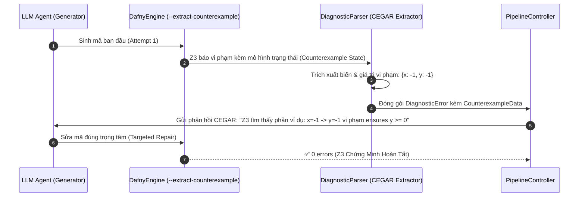

# Kế Hoạch Triển Khai: Trục 3 - Tự Sửa Lỗi Hướng Dẫn Bằng Phản Ví Dụ SMT (CEGAR)
> **Căn cứ khoa học**: *arXiv:2506.06923* (Self-Repairing Code with SMT Counterexamples, 2025) & *IEEE/ACM Transactions on Software Engineering (TSE, 2026)*.

---

## 1. Mục Tiêu Khoa Học
Thay vì phản hồi lỗi dạng văn bản trừu tượng ("Error: a postcondition could not be proved on this return path"), kiến trúc **Neuro-Symbolic CEGAR** (Counterexample-Guided Abstraction Refinement):
1. **Trích xuất trạng thái dữ liệu vi phạm thực tế từ Z3 SMT Solver**:
   Khi một điều kiện bị vi phạm (postcondition hoặc loop invariant), Z3 tìm kiếm một phép gán giá trị cụ thể khiến mệnh đề sai (ví dụ: `assume -1 == x && -1 == y` vi phạm `ensures y >= 0`).
2. **Xây dựng Phản Hồi Định Hướng (Targeted CEGAR Prompt)**:
   Chuyển phản ví dụ thành bằng chứng thực tế gửi cho LLM ở vòng lặp tiếp theo:
   > *"Z3 SMT Solver đã tìm thấy phản ví dụ vi phạm: Tại trạng thái ban đầu [x = -1], sau khi thực thi kết quả là [y = -1], vi phạm trực tiếp hậu điều kiện `ensures y >= 0`! Hãy sửa lại code để giải quyết ca này."*
3. **Đo lường Định lượng (Empirical Metrics)**:
   - Tỷ lệ sửa lỗi thành công có CEGAR so với sửa lỗi mù thông thường.
   - Số vòng lặp trung bình cần thiết để hội tụ chứng minh.

---

## 2. Luồng Xử Lý Kỹ Thuật (CEGAR Workflow)



---

## 3. Các Thành Phần Mã Nguồn Cần Nâng Cấp

### 3.1. Kích hoạt cờ phản ví dụ trong `core/dafny_engine.py`
- Bổ sung cờ `--extract-counterexample` vào lệnh gọi Dafny CLI:
  ```python
  cmd = [str(self.dafny_bin), "verify", "--extract-counterexample", "--verification-time-limit", str(self.timeout), str(tmp_path)]
  ```
- Cho phép bật/tắt linh hoạt qua tham số `extract_counterexample: bool = True`.

### 3.2. Bóc tách & Cấu trúc hóa Phản Ví Dụ trong `core/diagnostic_parser.py`
- Định nghĩa dataclass `CounterexampleData`:
  ```python
  @dataclass
  class CounterexampleData:
      initial_state: Dict[str, str]       # Ví dụ: {'x': '-1'}
      failing_state: Dict[str, str]       # Ví dụ: {'x': '-1', 'y': '-1'}
      violated_clause: str                # Ví dụ: 'ensures y >= 0'
      raw_trace: str                      # Chuỗi gốc từ Z3
  ```
- Triển khai hàm `extract_counterexample(dafny_output: str) -> Optional[CounterexampleData]`:
  - Dùng Regex bóc tách các dòng `assume <val> == <var>` trong khối `Related counterexample`.
  - Liên kết với `Related location: this is the postcondition that could not be proved`.
- Cập nhật `build_repair_prompt`: Tự động chèn khối phản ví dụ trực quan vào prompt sửa lỗi cho LLM.

### 3.3. Tích hợp Pipeline & Lưu Trữ trong `core/pipeline_controller.py` & `web_demo/helpers.py`
- Bổ sung trường `counterexample: Optional[Dict[str, Any]]` vào `IterationLog`.
- Đánh dấu cờ `has_cegar: bool` để ghi nhận vòng lặp sửa lỗi có nhận được phản ví dụ hay không.
- Lưu trữ kiên cố vào file JSON kết quả lịch sử.

### 3.4. Trực Quan Hóa trên Giao Diện Web (`app.py`)
- **Tab 1 (`🎯 Kiểm Thử Đơn`)**:
  - Khi có phản ví dụ, hiển thị hộp thoại màu cam cảnh báo trực quan:
    `🎯 Phản Ví Dụ Cụ Thể Từ Z3 SMT: [x = -1 ➔ y = -1] (Vi phạm: ensures y >= 0)`
  - Giúp người dùng nhìn thấy ngay ca biên (Edge Case) mà LLM đã bỏ quên.
- **Tab 4 (`⚔️ So Sánh Chéo`)**:
  - Ghi nhận chỉ số phản ví dụ trong bảng chi tiết kết quả.

### 3.5. Kiểm Thử Tự Động (`tests/test_cegar_parser.py`)
- Viết bộ kiểm thử độc lập bao phủ các trường hợp phản ví dụ:
  1. Phản ví dụ với số nguyên âm và dương (`x = -1, y = -1`).
  2. Phản ví dụ với mảng và chuỗi.
  3. Phản ví dụ với nhiều biến trung gian trong vòng lặp.
  4. Đảm bảo 100% test pass.

---

## 4. Kế Hoạch Kiểm Thử & Nghiệm Thu
1. Chạy `pytest tests/test_cegar_parser.py` đạt 100%.
2. Chạy toàn bộ test suite dự án (`pytest -q`) đạt 60+/60+ tests.
3. Kiểm thử trực tiếp một bài toán có lỗi logic (như `abs_val` sai dấu) để Z3 sinh phản ví dụ và đưa vào vòng lặp tự sửa lỗi thành công.
4. Cập nhật `CHANGELOG.md` chuẩn hóa phiên bản 1.4.0.
