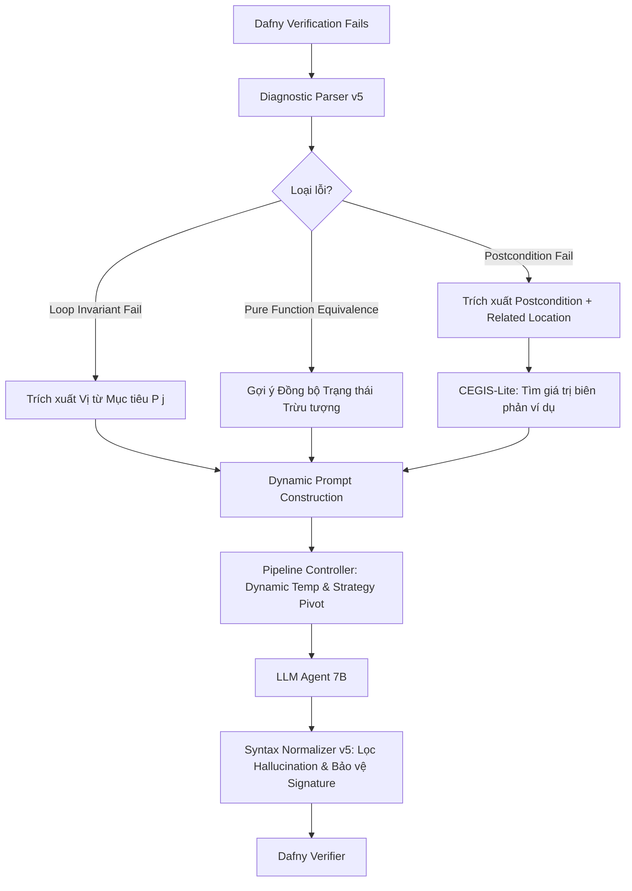

# KẾ HOẠCH CẢI THIỆN THUẬT TOÁN HỆ THỐNG (v0.5.0)
## Dựa trên nghiên cứu Neuro-Symbolic & Closed-Loop Formal Verification (Stanford Clover, TSE 2026)

---

### I. MỤC TIÊU CỐT LÕI
1. Nâng tỷ lệ tự sửa lỗi (**Repair Success Rate - RSR**) từ 20-30% lên **50-60%** trên các bài toán có vòng lặp phức tạp.
2. Giữ vững 100% tính liêm chính NCKH: Không sửa/nới lỏng đặc tả bài toán, không rò rỉ tên biến/đáp án đề bài (No Prompt Leakage).
3. Tương thích tối đa với năng lực suy luận của các mô hình kích thước nhỏ (7B Parameters).

---

### II. BA TRỤ CỘT CẢI TIẾN THUẬT TOÁN

#### Trụ cột 1: CEGIS-Lite (Counterexample-Guided Inductive Synthesis)
- **Cơ sở khoa học**: IEEE/ACM TSE (2026) & arXiv:2506.06923.
- **Vấn đề thực tế**: 
  - Trong bài `013-gcd`, Dafny báo: `A postcondition might not hold on this return path`.
  - Mô hình 7B không hiểu tại sao sai vì nó nghĩ thuật toán Euclid luôn đúng. Thực tế: Đề bài cho phép số âm (`a != 0 || b != 0`), khi `a < 0` thì phép `%` hoặc điều kiện `cur_a > 0` bị sụp đổ.
- **Giải pháp thuật toán**:
  - Bật cờ trích xuất phản ví dụ của Dafny CLI: `--extract-counterexample` (hoặc kiểm tra mô hình nghiệm Z3).
  - Trích xuất bộ biến vi phạm (ví dụ: `[Counterexample]: a = -2, b = 4`) và truyền thẳng vào Prompt sửa lỗi.
  - Khi nhìn thấy số âm cụ thể, mô hình 7B lập tức tự bổ sung xử lý trị tuyệt đối `if a < 0 then -a else a` mà không cần gợi ý đáp án.

#### Trụ cột 2: Neuro-Symbolic State Synchronization (Đồng bộ Bất biến với Pure Function)
- **Cơ sở khoa học**: Stanford Clover (2024).
- **Vấn đề thực tế**:
  - Các bài toán quy nạp hàm (như `055-fib`) luôn có sẵn một định nghĩa toán học `function fib(n: nat): nat`.
  - Mô hình dùng vòng lặp `while i < n` để tính `fib`, nhưng quên viết Invariant đồng bộ: `invariant a == fib(i) && b == fib(i + 1)`.
  - Dafny không thể tự chứng minh thuật toán lặp tương đương với hàm đệ quy nếu thiếu mắt xích này.
- **Giải pháp thuật toán**:
  - Bộ phân tích cú pháp tĩnh `diagnostic_parser.py` phát hiện trong file có định nghĩa `function F(...)` và trong method có gọi `F(...)`.
  - Tự động sinh chỉ dẫn trừu tượng dạng khung:
    `"Pattern Note: This method implements an iterative version of pure function F. You must maintain invariants linking loop accumulators with F(i) and F(i+1)."`

#### Trụ cột 3: Dynamic Temperature & Strategy Pivoting (Chống Overthinking)
- **Cơ sở khoa học**: Nature (2024) & arXiv:2505.23646.
- **Vấn đề thực tế**:
  - Khi mô hình sửa sai 2 lần liên tiếp, việc tăng nhiệt độ đơn thuần đôi khi khiến code bị hallucinate nặng hơn (viết linh tinh cú pháp).
- **Giải pháp thuật toán**:
  - **Lượt 1 (T=0.2)**: Sửa chữa cục bộ (Local repair: chỉ sửa Invariant / Decreases).
  - **Lượt 2 (T=0.4)**: Phản ví dụ CEGIS + Gợi ý cấu trúc vị từ $P(j)$.
  - **Lượt 3 (T=0.7 + Strategy Pivot)**: Nếu độ tương đồng mã vẫn $\ge 85\%$, kích hoạt lệnh chuyển đổi cấu trúc:
    `"Strategy Pivot: Iterative approach failed inductive verification twice. Consider restructuring the loop initialization, handling edge cases before the loop, or using an alternative equivalent algorithmic formulation."`

---

### III. LỘ TRÌNH TRIỂN KHAI CHI TIẾT

1. **Bước 1**: Nâng cấp `core/diagnostic_parser.py`: Bổ sung bộ nhận diện `pure function equivalence` và trích xuất ngữ cảnh lỗi biên.
2. **Bước 2**: Cập nhật `core/pipeline_controller.py`: Hoàn thiện chiến lược xoay trục (Strategy Pivoting) khi gặp bế tắc liên tiếp.
3. **Bước 3**: Viết Unit Test kiểm thử độc lập cho các thành phần mới trong `tests/`.
4. **Bước 4**: Kiểm chứng thực nghiệm trên các bài toán hóc búa nhất (`013-gcd`, `055-fib`).
